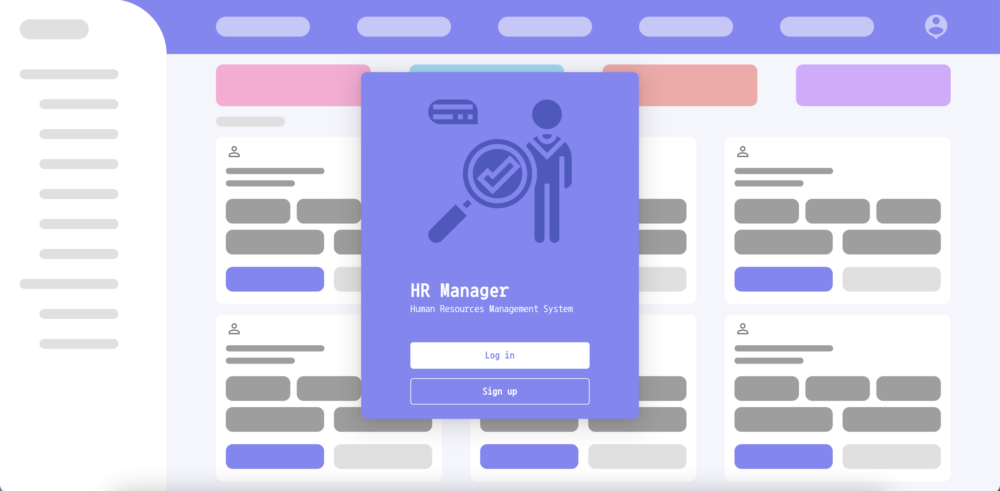
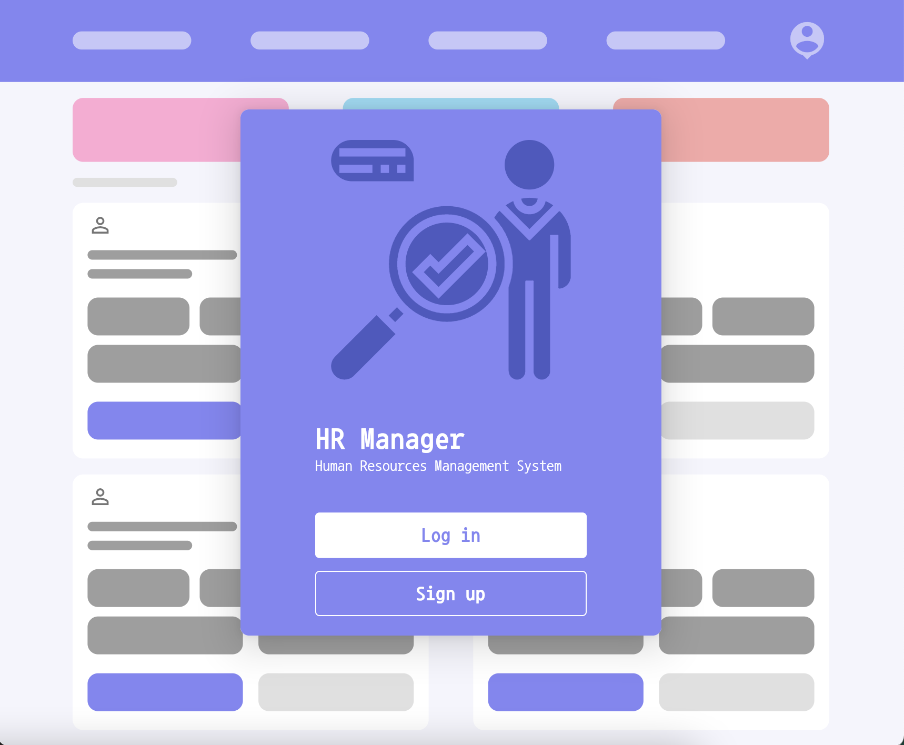
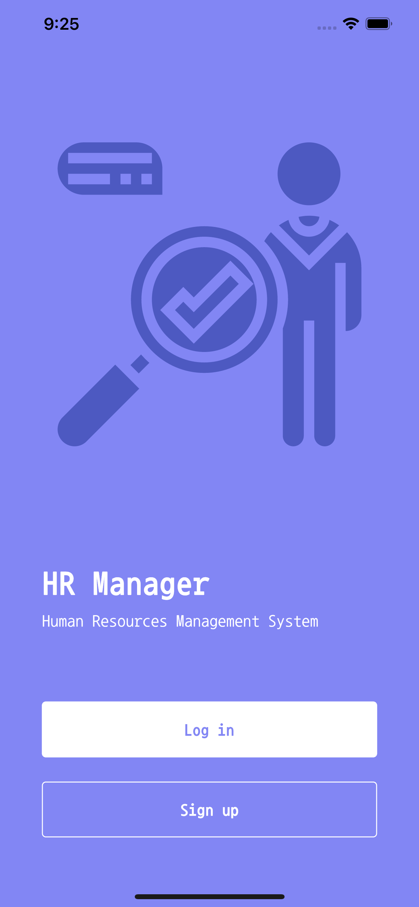
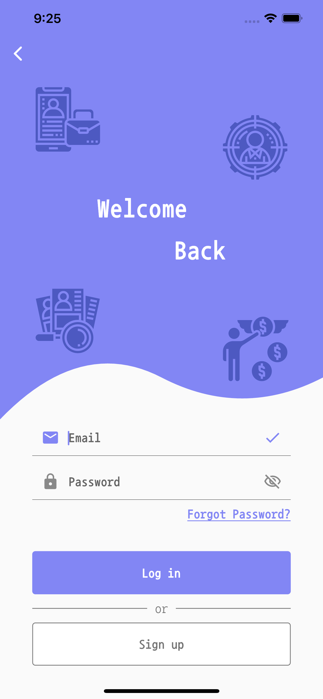
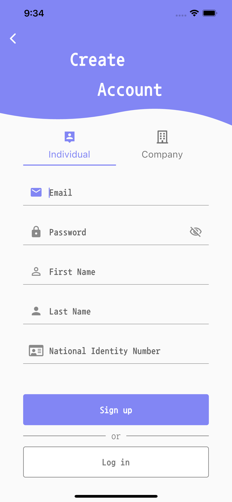

# 
Human Resources Management System
 
Frontend with Flutter

An alternative UI for the [Human Resources Management System](https://github.com/BBarisKilic/Human-Resources-Management-System) that uses [Flutter Framework](https://github.com/flutter/flutter) and provides responsive user interfaces and functionality for Web, iOS, and Android. The project has been written solely in [Dart Language](https://dart.dev/).

The app, HR Manager, is inspired by the beautiful designs made by [Excellent WebWorld](https://dribbble.com/shots/12579027-Best-HRMS-System/attachments/4184565?mode=media). In addition, icons that used in HR Manager designed by <a href="https://www.flaticon.com/authors/eucalyp" title="Eucalyp">Eucalyp</a> from <a href="https://www.flaticon.com/" title="Flaticon">www.flaticon.com</a>.

HR Manager follows the Model View Controller (MVC) design pattern and uses the [GetX](https://github.com/jonataslaw/getx) package for state management.

## 
Project Details

An HRMS, or human resources management system, is a suite of software applications used to manage human resources and related processes throughout the employee lifecycle. For more information, see the [article](https://www.netsuite.com/portal/resource/articles/human-resources/human-resources-management-system-hrms.shtml).

HRMS is consists of two-part: Frontend and Backend. There is one backend yet there are two frontends. Backend has been written solely in [Java Language](https://www.java.com/) and frontends have been used [React](https://reactjs.org/) and [Flutter](https://flutter.dev/).

See other parts of the HRMS:
- [HRMS-Frontend-React](https://github.com/BBarisKilic/HRMS-Frontend-React)
- [HRMS-Backend](https://github.com/BBarisKilic/HRMS-Backend)

## 1. Welcome Page

A page that serves as the starting point of the website/application.

### 1.1. Desktop

### 1.2. Tablet

### 1.3. Phone

## 2. Login Page

A page where user identification and authentication is performed.

### 2.1. Desktop

- coming...

### 2.2. Tablet

- coming...

### 2.3. Phone

## 3. Signup Page

A page that enables users and organizations to independently register and gain access to system.

### 3.1. Desktop

- coming...

### 3.2. Tablet

- coming...

### 3.3. Phone

